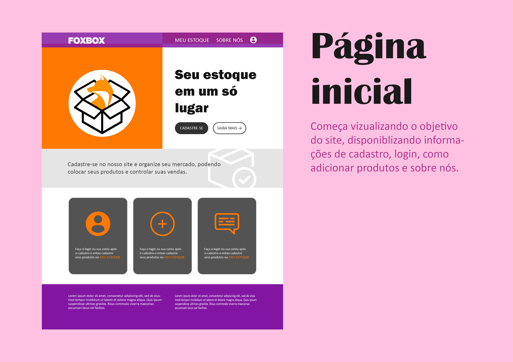

# DevTolls Developer - Projeto FOX BOX
Trabalhei como Líder da equipe coodernando da melhor forma possível para entregar o trabalho. Desenvolvido pela equipe DevTools Developer. Feito para mostrar nossos recursos em web2, usando as linguagens de programação HTML, CSS, Js, Python e MySQL. 
# Foram utilizadas as linguagens:

 
 
    
    
    
  

  
Site Original Em: <a href="https://devtools-developer.github.io/Projeto-Estoque/foxbox/">https://devtools-developer.github.io/Projeto-Estoque/foxbox/</a>  

